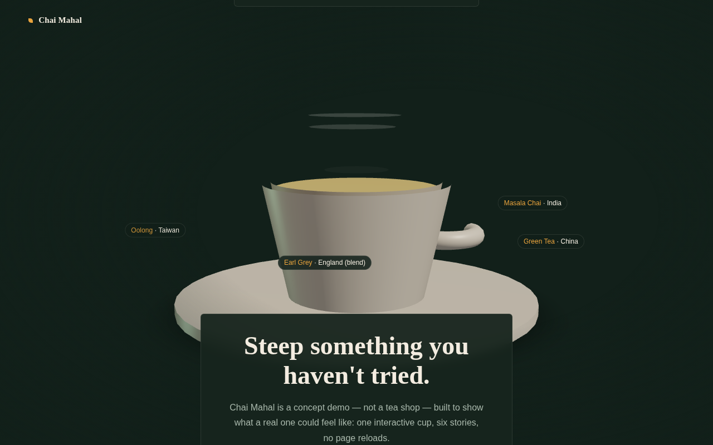

# Chai Mahal — A Tea Atlas

**One cup, poured six ways.** A scroll-driven 3D showcase where a single teacup changes colour, strength, and character as you scroll through six teas from around the world — ending in a drag-to-rotate finale with all six side by side.



Built as the same "interactive 3D + motion narrative" pattern as a hardware-product site, applied to something warmer: **React Three Fiber** for the 3D cup, **GSAP ScrollTrigger** for tying its rotation, camera, and liquid colour to scroll position.

## What it does

| Scroll position | What happens |
|---|---|
| Hero | Cup sits centre-stage, steam rising, idle |
| Masala Chai → Chamomile (6 sections) | Liquid colour tweens live to match each tea; camera drifts in |
| Atlas finale | All six labels appear around the cup, drag-to-rotate re-enables |

The whole cup also does one continuous slow turn tied to total scroll progress, so it reads as one connected motion rather than six separate steps.

## Stack

- **React 19 + Vite**
- **React Three Fiber + drei** — the Three.js/WebGL scene
- **GSAP + ScrollTrigger** — all scroll-scrubbed animation

The cup, saucer, handle, and steam are all built from primitives directly in Three.js — no `.glb`/`.gltf` file, so no external asset to fetch or fail to load.

## Notable implementation details

- Every scroll-driven property (rotation, camera position, liquid colour) is written straight to Three.js objects via refs, never through React state — `setState` on every scroll tick visibly lags a scrubbed animation.
- The model only gets wired to the scroll timeline once it signals it has actually mounted inside the `<Canvas>` (an `onReady` callback), rather than assuming normal React effect order — a Canvas mounts its scene graph through its own renderer, which isn't guaranteed to have committed by the time a sibling effect runs.
- No HDR environment map — reflections come from a small manual light rig instead, so nothing is fetched from an external CDN at runtime that could fail and take the scene down with it.
- `prefers-reduced-motion` is respected — animations snap instead of scrub for users with that OS setting on.
- A WebGL support check swaps in a static fallback for devices/browsers that can't run the scene.
- Every text panel (hero, tea cards, footer) sits on a translucent backdrop so it stays legible regardless of where the cup happens to be mid-rotation — worth a look at `styles.css` if you're re-skinning this for something else, since it's an easy thing to miss.

## Run it locally

Requires Node 18+.

```bash
git clone <this-repo-url>
cd chai-mahal
npm install
npm run dev
```

Open the local URL it prints (typically `http://localhost:5173`).

## Build & deploy

```bash
npm run build     # → dist/
npm run preview   # sanity-check the production build locally
```

Static output — deploys anywhere. On Vercel or Netlify, defaults work with no configuration (Vite is auto-detected).

## What this deliberately doesn't cover

- No real `.gltf` model pipeline (Draco, LOD) — the cup is primitives, not an optimised imported asset.
- No CMS — all tea copy lives in `src/content.js`.
- No formal performance audit has been run against it.

## Project structure

```
src/
  App.jsx                    → page layout, section refs, wiring
  content.js                 → tea data (name, origin, colour, specs)
  styles.css                 → design tokens + layout
  components/
    Scene.jsx                → R3F Canvas, lighting, camera, tea labels
    TeaCup.jsx                → procedural cup/saucer/steam + exposed refs
  hooks/
    useScrollTimeline.js     → all GSAP ScrollTrigger wiring
```
